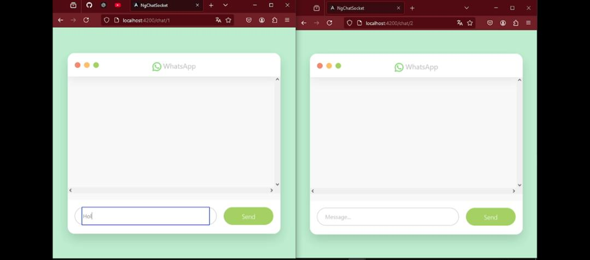

# Chat whit Spring and Angular
 
 

Aplicación de chat en tiempo real desarrollada con **Spring Boot** en el backend y **Angular** en el frontend. La aplicación utiliza WebSocket para manejar la comunicación en tiempo real entre los usuarios. 

## Características principales 

- **Actualizaciones en tiempo real**: Los mensajes se envían y reciben al instante mediante WebSocket.
- **Arquitectura cliente-servidor**: El backend gestiona la lógica de negocio y la comunicación, mientras que el frontend ofrece una interfaz de usuario moderna.
- **Tecnologías utilizadas**:
  - Backend: Spring Boot, WebSocket.
  - Frontend: Angular.

## Requisitos previos

Antes de ejecutar la aplicación, asegúrate de tener instalado:

- **Java 11** o superior.
- **Node.js** y **npm**.
- **Angular CLI**.
- **Maven**.

## Configuración y ejecución

### Backend (Spring Boot)

1. Clona este repositorio:
   ```bash
   git clone https://github.com/MiguelAntonioRS/Chat-Spring-Angular.git
   cd Chat-Spring-Angular/backend
   ```
   
2. Compila y ejecuta el backend:
   ```bash
   mvn clean install
   mvn spring-boot:run
   ```

3. El backend estará disponible en `http://localhost:8080`.

### Frontend (Angular)

1. Navega al directorio del frontend:
   ```bash
   cd Chat-Spring-Angular/frontend
   ```

2. Instala las dependencias:
   ```bash
   npm install
   ```

3. Inicia el servidor de desarrollo:
   ```bash
   ng serve
   ```

4. El frontend estará disponible en `http://localhost:4200`.

## Estructura del proyecto

```
Chat-Spring-Angular/
├── backend/        # Código fuente del backend (Spring Boot)
└── frontend/       # Código fuente del frontend (Angular)
```

## Tecnologías utilizadas

### Backend
- Spring Boot
- WebSocket

### Frontend
- Angular
- TypeScript
- HTML/CSS

## Contribuciones

Las contribuciones son bienvenidas. Si deseas contribuir:

1. Haz un fork del repositorio.
2. Crea una rama para tu función o corrección de errores:
   ```bash
   git checkout -b feature/nueva-funcion
   ```
3. Realiza tus cambios y haz un commit:
   ```bash
   git commit -m "Agregada nueva función"
   ```
   
© 2025 Miguel Antonio Rojas Sucarino
