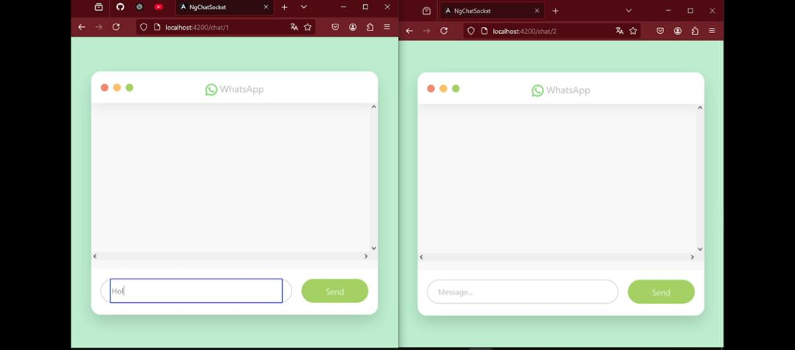

# Chat whit Spring and Angular



# 🚀 Real-Time Chat Application

A real-time chat application built with **Spring Boot** (backend) and **Angular** (frontend). This app uses **WebSocket** for instant message delivery between users.

--- 
 
## 🧩 Main Features 
 
- ✅ **Real-time updates**: Messages are sent and received instantly using WebSocket.
- 🏗️ **Client-server architecture**: Backend handles business logic and communication, while the frontend provides a modern user interface.
- 💡 **Tech Stack**:
  - **Backend**: Spring Boot, WebSocket
  - **Frontend**: Angular, TypeScript, HTML/CSS
 
---

## 🛠️ Prerequisites

Before running the application, make sure you have the following installed:

- **Java 11** or higher
- **Node.js** and **npm**
- **Angular CLI**
- **Maven**

---

## ⚙️ Setup & Running Instructions

### Backend (Spring Boot)

Clone the repository:
```bash
git clone https://github.com/MiguelAntonioRS/Chat-Spring-Angular.git 
cd Chat-Spring-Angular/backend
```
   
Build and run the backend:
   ```bash
   mvn clean install
   mvn spring-boot:run
   ```

The backend will be available at:
👉 http://localhost:8080 

### Frontend (Angular)

Navigate to the frontend directory:
   ```bash
   cd Chat-Spring-Angular/frontend
   ```

Install dependencies:
   ```bash
   npm install
   ```

Start the development server:
   ```bash
   ng serve
   ```

The frontend will be available at:
👉 http://localhost:4200

📁 Project Structure

```
Chat-Spring-Angular/
├── backend/        # Backend source code (Spring Boot)
└── frontend/       # Frontend source code (Angular)
```

## 🛰️ Technologies Used

### Backend
- Spring Boot
- WebSocket

### Frontend
- Angular
- TypeScript
- HTML/CSS

## Contribuciones

🤝 Contributing 

Contributions are welcome! If you'd like to contribute: 

  1. Fork the repository.
  
  2. Create a new branch for your feature or bugfix:
    
   ```bash
   git checkout -b feature/new-feature
   ```

3. Make your changes and commit them:

   ```bash
   git commit -m "Add new feature"
   ```
   
© 2025 Miguel Antonio Rojas Sucarino
